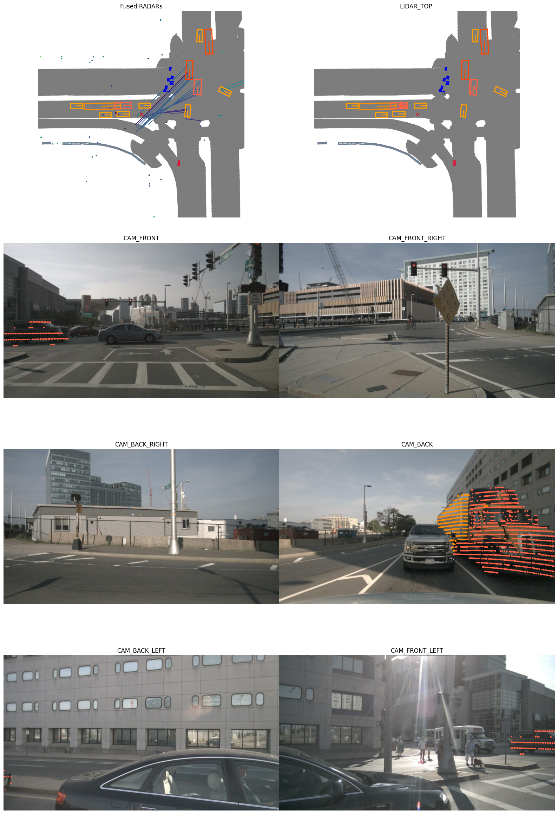
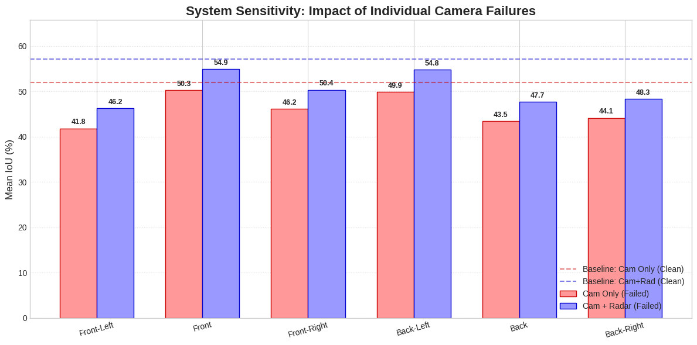
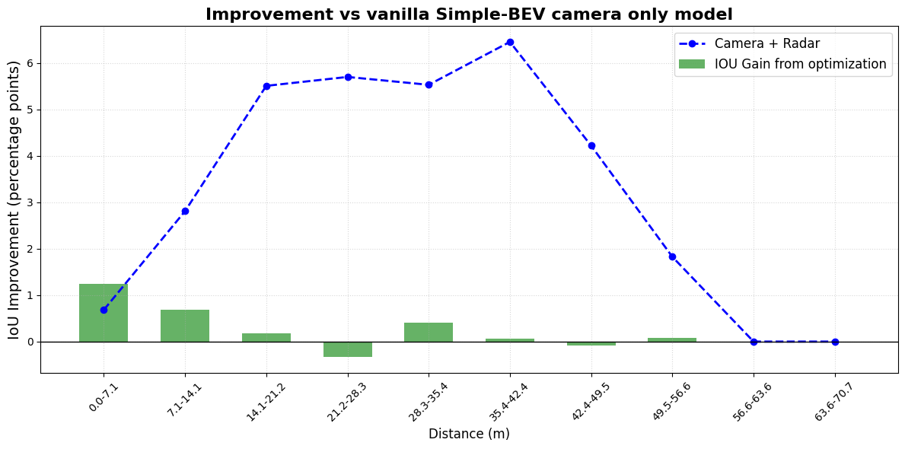

# CV-nuScenes

This project explores Bird's-Eye View (BEV) perception on the [nuScenes](https://www.nuscenes.org/download) dataset. The main focus is comparing camera-only and camera+radar Simple-BEV models, testing robustness under degraded sensor inputs, and experimenting with distance-aware confidence thresholding during inference.

## Repository Contents

- `BEV_1.ipynb` - basic work with `nuScenes mini`, `lidarseg`, sensor visualization, and data preparation.
- `Baseline_models_comparisons.ipynb` - comparison of camera-only and camera+radar models under clean, dark, and camera-failure scenarios.
- `Threshold_optimization_+_comparison.ipynb` - distance-based adaptive confidence thresholding for BEV inference and comparison with baselines.
- `Failed_Fine_tune_experiment.ipynb` - an unsuccessful fine-tuning experiment with a modified loss function and stronger distance weighting.
- `images/` - saved visualizations and result plots used in this README.

## Data and Models

The experiments use `nuScenes mini` and `nuScenes-lidarseg mini`.

Useful links:

- [nuScenes download page](https://www.nuscenes.org/download)
- [Google Drive with additional project files](https://drive.google.com/file/d/1DRbeJ1OboL37W7Dl4eBbCTzvC-Uk1oLf/view?usp=sharing)

The notebooks also download pre-trained checkpoints for camera-only and camera+radar model variants.

## Key Results

In the baseline comparison, the camera+radar model is more robust than the camera-only model, especially under poor lighting and single-camera failure:

- Clean: camera-only `52.32` Mean IoU, camera+radar `56.79` Mean IoU.
- Dark: camera-only `33.57` Mean IoU, camera+radar `44.60` Mean IoU.
- Random camera failure: camera-only `45.81` Mean IoU, camera+radar `49.28` Mean IoU.

The `Threshold_optimization_+_comparison.ipynb` notebook additionally evaluates adaptive confidence thresholding. The idea is to use a stricter threshold for near-range predictions and a softer threshold for distant objects, where the model is typically less confident.

## Visualizations

The images below are stored in the `images/` directory.

### nuScenes Sensor Layout

This visualization shows a nuScenes sample with fused radar, top-view LiDAR, and six surrounding cameras.

### Individual Camera Failure Sensitivity

This plot compares camera-only and camera+radar performance when individual cameras fail. The radar-assisted model consistently keeps a higher Mean IoU.

### Distance-Based Improvement

This plot shows IoU improvement over the vanilla Simple-BEV camera-only model across distance bins. It also compares the optimization gain with the camera+radar improvement trend.

## How to Run

The project is easiest to run in Google Colab or another GPU-enabled environment. A typical workflow is:

1. Open the target notebook.
2. Install the dependencies from the first cells (`nuscenes-devkit`, `tensorboardX`, `timm`, `efficientnet_pytorch`, `lyft-dataset-sdk`).
3. Download `nuScenes mini`, `lidarseg mini`, maps, and checkpoints.
4. Run the data preparation and evaluation cells.
5. Compare the results using IoU metrics and the generated plots.

## Main Takeaway

BEV perception combines camera, radar, and LiDAR information in a shared metric coordinate system. This is useful for autonomous driving because the scene can be analyzed around the ego vehicle from a top-down perspective. The experiments in this repository show that radar improves robustness in challenging conditions, while distance-aware inference thresholding can provide additional gains for selected distance ranges.